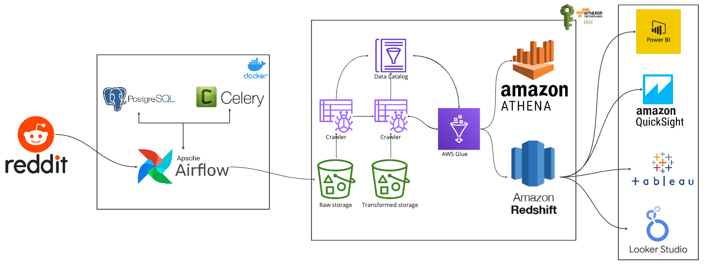

# From Reddit Posts to Analytics: Building a Serverless Data Pipeline with S3, Glue, and Athena

This is my hands-on project where I built an **end-to-end data pipeline** using AWS and Apache Airflow.  
The goal was simple: collect Reddit posts, store them in the cloud, transform them, and finally make them queryable for analytics.  

---

## 🚀 Project Overview
1. **Data Extraction**  
   - Used Reddit API to fetch posts.  
   - Credentials and configs handled via a `config.conf` file (ignored in Git for security).  
   - Output stored locally first in CSV format.  

2. **Data Orchestration with Airflow**  
   - Wrote DAGs in Airflow to automate extraction and upload steps.  
   - Defined separate pipelines for Reddit ETL and S3 upload.  

3. **Data Lake Storage (Amazon S3)**  
   - Raw CSV files were uploaded into an S3 bucket.  
   - Created separate folders for **raw** and **transformed** data.  

4. **Data Transformation with AWS Glue**  
   - Used a Glue job to transform raw CSV into **Parquet format**.  
   - Parquet is more efficient for querying and analytics.  

5. **Cataloging with AWS Glue Crawler**  
   - Ran a crawler to detect schema automatically.  
   - Created a database table linked to S3 data.  

6. **Querying with Athena**  
   - Queried the transformed dataset using standard SQL.  
   - Verified results directly in Athena.  

---

## 🛠️ Tech Stack
- **Python** (pandas, boto3, pyarrow)
- **Apache Airflow** (for DAG scheduling)
- **Amazon S3** (data lake storage)
- **AWS Glue** (ETL jobs + schema crawler)
- **Amazon Athena** (SQL queries on S3)
- **Docker** (to run Airflow locally)

---


## Architecture 



## 📂 Repository Structure
```
├── dags/                 # Airflow DAGs
│   └── reddit_dag.py
├── etls/                 # ETL scripts
│   └── aws_etl.py
├── pipelines/            # Pipeline functions
│   └── aws_s3_pipeline.py
│   └── reddit_pipeline.py
├── utils/                # Utility scripts
│   └── constants.py
├── docker-compose.yml    # Airflow setup
├── requirements.txt      # Dependencies
└── README.md             # Project documentation
```

---

## ⚡ Key Learnings
- How to orchestrate pipelines with **Airflow**.  
- Why **Parquet** is better than CSV for analytics.  
- How **Glue Crawlers + Athena** make data lake querying easier.  
- Managing configs and secrets securely (not pushing them to GitHub).  
- Hands-on practice with AWS services that are widely used in Data Engineering roles.  

---

## 🔮 Next Steps
- Connect Athena tables to **Amazon QuickSight** for dashboards.  
- Try the same pipeline with **Amazon Redshift**.  
- Add unit tests for pipeline scripts.  

---

## 📌 Notes
This repo is mainly for **learning purposes**. Some services (Glue, Athena, Redshift) may incur small AWS costs if not under free tier.  

---

✍️ *Built this project as part of my journey into Data Engineering — feedback and suggestions are welcome!*

